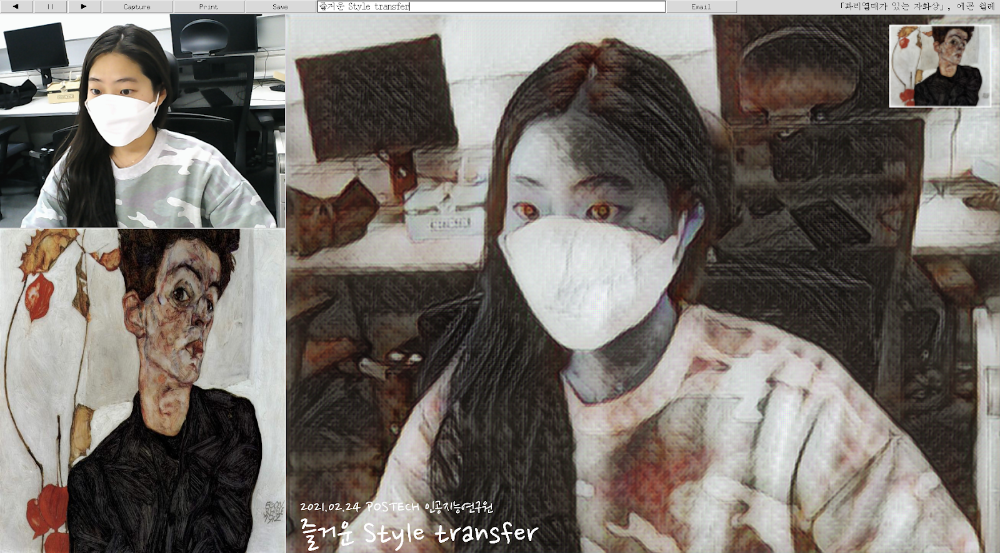

# Style transfer manual

- [Style transfer manual](#style-transfer-manual)
- [Style transfer 환경 설정](#style-transfer-환경-설정)
  - [1. working directory 설정](#1-working-directory-설정)
  - [2. docker 환경 설정](#2-docker-환경-설정)
- [프로그램 실행 및 작동](#프로그램-실행-및-작동)
  - [1. 프로그램 실행](#1-프로그램-실행)
  - [2. 작동 방법](#2-작동-방법)
- [부록](#부록)

# Style transfer 환경 설정

## 1. working directory 설정

```bash
# git clone
$ git clone [git repository]

# run shell script
$ cd [git repository]/scripts
$ chmod +x install.sh
$ ./install.sh

# .env 파일 수정(아래 주의사항 참고)
$ cd ..
$ vi .env
EMAIL_ADDRESS=EXAMPLE@gmail.com
EMAIL_PASSWORD=EXAMPLE
```

주의사항

- gmail 계정만 사용 가능
- `.env` 파일 내에 띄어쓰기, 큰 따옴표 사용 금지
- 파일 수정 이후 관리자 계정 보안 설정 변경
  ([구글 계정관리](https://myaccount.google.com/) → [보안](https://myaccount.google.com/security) → 제 3자 액세스 → 보안 수준이 낮은 앱의 액세스 `사용`으로 변경)

## 2. docker 환경 설정

[Installation Guide - NVIDIA Cloud Native Technologies documentation](https://docs.nvidia.com/datacenter/cloud-native/container-toolkit/install-guide.html#docker)

```bash
# install docker && nvidia-docker
# (위의 공식 가이드 링크 참고하는 것이 가장 정확함)

# build docker image(최초 1회)
$ cd [where dockerfile exists]
$ sudo docker build -t ponix:latest .
```

# 프로그램 실행 및 작동

## 1. 프로그램 실행

```bash
# 카메라 및 프린터 usb 연결
# (반드시 docker container 실행 전에 장치 연결 끝내야 됨)

# run docker container
$ sudo docker run --privileged --rm -it \
		--runtime=nvidia \
		--env DISPLAY=$DISPLAY \
		--env="QT_X11_NO_MITSHM=1" \
		-v /dev/video0:/dev/video0 \
		-v /tmp/.X11-unix:/tmp/.X11-unix:ro \
		-v /usr/share/fonts/truetype/nanum:/usr/share/fonts/truetype/nanum \
		-v $(pwd):/app \
		-t ponix:latest

# run shell script on host
# (프린트 기능 위해 container 종료 전까지 계속 실행)
$ chmod +x ./scripts/print_out_host.sh
$ ./scripts/print_out_host.sh

# run python script on container
# (option 설명 및 ZeroDivisionError 해결 방법 부록 참고)
$ python3 run_cam.py --models model_list.csv
```

## 2. 작동 방법



1. Style 변경
   - 자동 재생하기 : `--num_sec` (default=10/10초)마다 style 자동 변경
   - 임의 변경하기 : ◀ , ▶
2. 작동 순서(캠 촬영부터 출력까지)

   - ⏸️ : 캠 촬영 및 자동 재생 일시 정지
   - ⬜ : 원하는 문구 작성하기(한글 최대 29자, 영문(소문자 기준) 최대 55자, 특수문자 및 공백 가능)
   - Save  : 찍은 사진 저장하기(화면 오른편 → 출력 전 최종 사진 확인 가능) /  ⏸️누른 후에 활성화
   - Print : 사진 출력하기 / Save 누른 후에 활성화
   - Email : 이메일 전송하기(팝업 창에 사진 받을 이메일 주소 기입)
   - ⏸️ : RESET / 재촬영하기 (사진 출력 후 ⏸️ 실행시 📁print 내 파일 자동 삭제됨)

3. 추가 기능

- Capture : 누른 동시에 📁capture 에 저장됨 (단, Save 와 달리 문구 및 캡션 등이 없는 사진 저장)
- ⏸️ & Save 누른 상태에서도 ◀ , ▶ 이용하여 style 변경 가능(즉, 사진 찍은 후 멈춤 상태에서 style 고를 수 있음

주의사항

- email 전송 후 success 팝업 창 뜰때까지 대기하기
- Style transfer 종료 시 타이틀바의 ✖️ 버튼 눌러서 종료하기(terminal창 강제 종료 시 error 발생 가능)
- 실행 도중 USB포트에서 CAM빼지 않기(만약 이후 재실행 시 캠 인식을 못한다면 USB 재연결해보기)
- Print 한 사진은 ./print에 임시저장 후 자동삭제되므로 파일 소장 원하면 이메일 기능 사용

# 부록

- single/multiple image style transfer(real-time❌)

  ```bash
  # run docker container
  $ sudo docker run --privileged --rm -it \
  		--runtime=nvidia \
  		--env DISPLAY=$DISPLAY \
  		--env="QT_X11_NO_MITSHM=1" \
  		-v /dev/video0:/dev/video0 \
  		-v /tmp/.X11-unix:/tmp/.X11-unix:ro \
  		-v /usr/share/fonts/truetype/nanum:/usr/share/fonts/truetype/nanum \
  		-v $(pwd):/app \
  		-t ponix:latest

  # 특정 style 요청한 경우
  $ python3 run_test.py \
  		--content path/to/content.jpg \
  		--style_model path/to/model.ckpt \
  		--output output/output.jpg \

  # 별도 style 지정 없이 전체 model에 대한 결과가 필요한 경우
  # /content 내의 모든 사진으로 style transfer 실행
  # 결과는 /output에 자동 저장
  $ python3 run_multi_test.py

  ```

- model 추가 학습

  1. style image(원하는 이미지) 다운로드 후 `r$ python3 run_train.py`실행

     - style image 다운로드에 이용한 사이트

       [WikiArt.org - Visual Art Encyclopedia](https://www.wikiart.org/)

  2. 자세한 설명은 아래 github 참조
     [hwalsuklee/tensorflow-fast-style-transfer](https://github.com/hwalsuklee/tensorflow-fast-style-transfer)

- `run_cam.py` 실행 option 설명
  - `--device_id` : 사용 카메라(default=0, 카메라 여러대 사용할 경우에만 지정하면 됨)
  - `--inp_width` : 이미지 가로 사이즈(default=700, 가로 사이즈와 스타일 강도는 반비례 관계, 테스트 결과 700이 가장 적당함)
  - `--num_sec` : style 자동 변경 시간 간격(default=10, 단위:초, 원하는 시간으로 변경 가능)
  - `--email` : email 전송 기능 사용 여부(default=False, email 전송 기능 필요한 경우 True 입력, 단 `.env` 파일 설정 필수)
  - `--models` : model과 style 경로 정보가 저장된 csv 파일 경로(default=없음, 필수 입력)
- `run_cam.py`의 ZeroDivisionError 해결 방법

  ```bash
  [ WARN:0] global /tmp/pip-req-build-sw_3pm_8/opencv/modules/videoio/src/cap_v4l.cpp (893) open VIDEOIO(V4L2:/dev/video0): can't open camera by index
  cam width: 0.000000, cam height: 0.000000
  Traceback (most recent call last):
    File "run_cam.py", line 315, in <module>
      main()
    File "run_cam.py", line 310, in main
      app = App(root, args)
    File "run_cam.py", line 84, in __init__
      args.device_id, args.inp_width, self.master.winfo_width(), self.disp_height
    File "/app/cam_utils.py", line 81, in __init__
      self.set_frame_shape(inp_width, disp_width, disp_height)
    File "/app/cam_utils.py", line 91, in set_frame_shape
      inp_height = int(inp_width * float(cam_height / cam_width))  # keep aspect ratio
  ZeroDivisionError: float division by zero
  ```

  반드시 아래 5단계 순서 지켜야 됨

  1. docker container 종료
  2. 카메라 usb 연결 해제
  3. `$ sudo rm -rf /dev/video*`
  4. 카메라 usb 다시 연결
  5. docker container 실행
